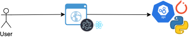

# simple-chat-bot

This is a simple ui + engine of chat bot.

## Tech Stack

For the front end it was used:

| Library | Description  |
| ---    |:-----|
|[Electron](https://electronjs.org/)| The standalone to display the ui |
|[React](https://es.reactjs.org/)| Library to build the user interface |

For the backend, which is the engyne that will perform the AI, we have:

| Language/Library | Description  |
| ---    |:-----|
|[Python](https://www.python.org/)| Backend language, very used for AI/DL |
|[PyTorch](https://pytorch.org/)| AI library used for this code |

## Project organization

The project has to sub-projects:

- engine: this is the backend service that will run the chatbot logic
- user-interface: that has the user interface of the solution

The idea is to have:



# How to run it

The requirements to run this you have to be installed:

- Docker
- npm

The following execution mode is just for development only.

With that, we will need to run:

```
make start
```

On the make file you will see that there are three tasks, as we did a task for start only the engine and the front end, when needed.

This command will:

- build the docker image for the engine (on python/pytorch/flask) on the port 8080
- build the front end and start the dev mode of electron